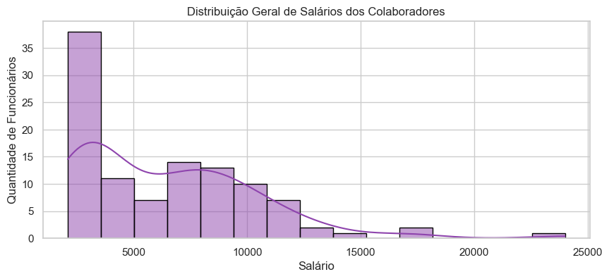
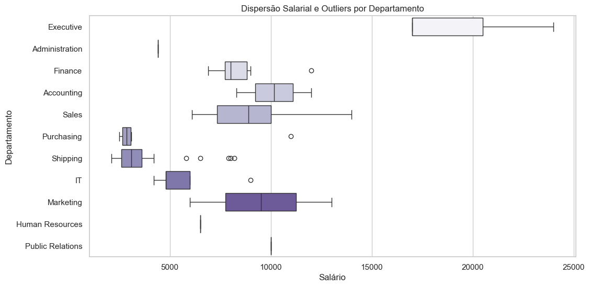
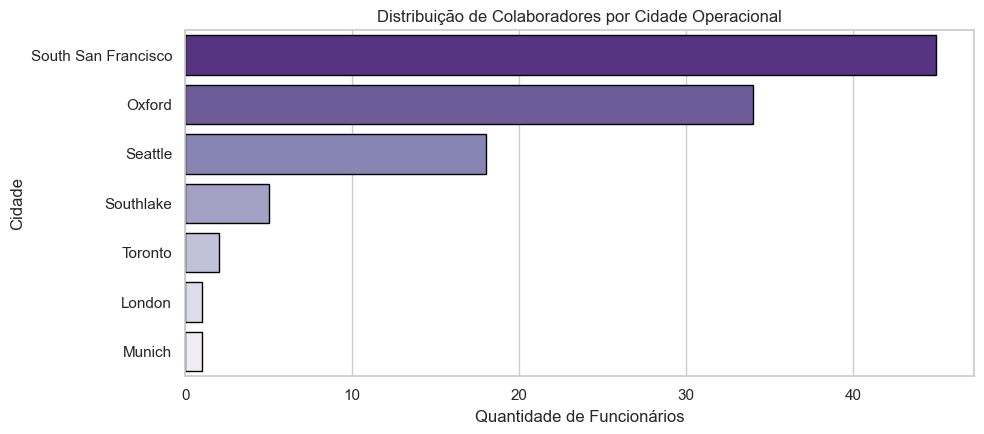
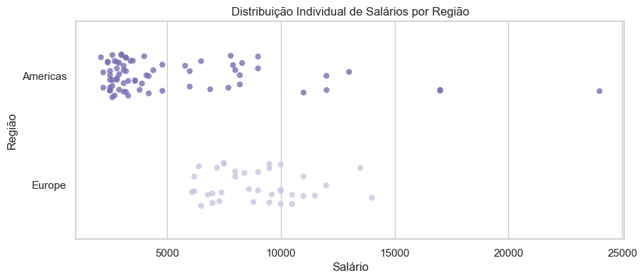

# Análise Exploratória de Dados: Estrutura Salarial e Distribuição Geográfica (RH)

**Aluno:** Anaysa Pereira Lopes
**Módulo:** Visualização de Dados e Business Intelligence  
**Data:** Julho de 2026  

---

## 1. Objetivo do Trabalho

Este projeto tem como objetivo atuar como analista de dados para a área de Recursos Humanos, utilizando o banco de dados FreeSQL (esquema HR). O foco foi extrair informações estratégicas sobre funcionários, cargos, departamentos e localizações geográficas para apoiar decisões de gestão e entender os padrões de remuneração da empresa.

---

## Explicação Simples das Tabelas Usadas
Para a construção das análises, foram extraídos dados das seguintes tabelas do esquema HR:
*   **HR.EMPLOYEES:** Contém o registro principal dos funcionários, incluindo identificação, data de contratação, cargos (`JOB_ID`) e salários (`SALARY`).
*   **HR.DEPARTMENTS:** Identifica os setores e departamentos da empresa (`DEPARTMENT_NAME`).
*   **HR.JOBS:** Armazena os títulos oficiais dos cargos (`JOB_TITLE`) e os limites de salário mínimo e máximo permitidos para cada função.
*   **HR.LOCATIONS:** Fornece o endereço físico, cidade (`CITY`) e o estado (`STATE_PROVINCE`) onde os departamentos estão sediados.
*   **HR.COUNTRIES:** Associa as localizações aos respectivos países (`COUNTRY_NAME`).
*   **HR.REGIONS:** Agrupa os países em regiões macroeconômicas (`REGION_NAME`), como Americas e Europe.

---

## Resumo das Duas Consultas SQL
As consultas foram estruturadas no FreeSQL utilizando relacionamentos por `LEFT JOIN` e filtros com `WHERE` para garantir a integridade dos dados:

### Query 1 — Salário por Departamento e Cargo
*   **Objetivo:** Analisar a distribuição de salários cruzando os setores e as funções.
*   **Estrutura:** Relaciona a tabela `EMPLOYEES` com `DEPARTMENTS` e `JOBS` utilizando dois `LEFT JOIN`. Foi aplicado um filtro `WHERE` para remover registros nulos e garantir que apenas salários válidos fossem exportados.
*   **Arquivo gerado:** `query_01.csv`

### Query 2 — Funcionários por Região (com Localização)
*   **Objetivo:** Analisar salários e a distribuição geográfica dos colaboradores.
*   **Estrutura:** Conecta a tabela `EMPLOYEES` com `DEPARTMENTS`, `LOCATIONS`, `COUNTRIES` e `REGIONS` através de múltiplos `LEFT JOIN`. Foi utilizado o filtro `WHERE REGION_NAME IS NOT NULL` para expurgar inconsistências e isolar as operações geográficas ativas.
*   **Arquivo gerado:** `query_02.csv`

---

## Explicação da Análise Feita em Python
O projeto foi estruturado em um fluxo lógico dividindo-se nas seguintes etapas do script:

1.  **Preparação do Ambiente e Carga de Dados:** Importação das bibliotecas essenciais (`pandas`, `matplotlib.pyplot` e `seaborn`), configuração de estilos de visualização (`whitegrid` com a paleta roxa) e carregamento dos arquivos CSV através do Pandas.
2.  **Diagnóstico Estrutural e Auditoria de Qualidade:** Execução de comandos como `.shape`, `.info()`, `.isnull().sum()` e `.duplicated().sum()` para auditar a volumetria, os tipos de dados e rastrear possíveis registros nulos ou duplicados nas duas bases.
3.  **Análise Descritiva dos Dados:** Isolamento matemático das métricas exigidas (Média, Mediana, Mínimo e Máximo), agrupamento da média salarial por departamento, contagem de funcionários por país e rastreamento analítico de valores nulos específicos (identificados na coluna `STATE_PROVINCE`).
4.  **Visualização de Dados:** Construção de gráficos estatísticos e geográficos avançados para extração de insights visuais da folha de pagamento.

---

## Principais Resultados Encontrados e Insights

### A. Auditoria, Qualidade dos Dados e Governança (Foco no Negócio)
*   **Tratamento de Inconsistências:** A análise estrutural no Python (`.isnull().sum()`) detectou a existência de registros nulos críticos no campo `STATE_PROVINCE` da Query 2. A investigação detalhada no código isolou o funcionário afetado, permitindo mapear que o erro de cadastro ocorre na operação da Europa (região de Oxford, Reino Unido, onde o conceito de "Estado" não se aplica da mesma forma que nas Américas).
*   **Eficácia dos Filtros SQL:** A aplicação estratégica das cláusulas `WHERE` nas consultas garantiu que o diagnóstico de salários não fosse poluído por registros órfãos ou incompletos, salvaguardando a acurácia das médias calculadas.

### B. Estrutura Salarial e Dispersão (Query 1)
*   **Equilíbrio entre Média e Mediana:** A proximidade entre a Média Salarial (R$ 6.456,75) e a Mediana Salarial (R$ 6.150,00) indica que a folha de pagamento possui uma distribuição central relativamente equilibrada e homogênea para a maior parte do quadro de funcionários. 
*   **Amplitude e o Topo Executivo:** Embora o Intervalo Interquartil (IQR) de R$ 5.850,00 mostre que 50% dos colaboradores ganham entre R$ 3.100,00 e R$ 8.950,00, o salário máximo de R$ 24.000,00 (setor *Executive*) representa um teto isolado que estende a amplitude total da folha.
*   **Falsos Outliers por Baixa Volumetria:** A análise gráfica do Boxplot revelou marcações de "outliers" em setores como *Finance*, *IT* e *Purchasing*. No entanto, a auditoria de dados provou que isso ocorre apenas devido à baixa volumetria de funcionários na amostra desses departamentos (onde a diferença entre o salário do gestor e de seus poucos subordinados acaba gerando uma marcação matemática de anomalia, que não reflete uma inconsistência real de negócio).

### C. Análise Geopolítica e Distribuição Geográfica (Query 2)
*   **Alta Concentração Logística/Operacional:** A força de trabalho da organização não está pulverizada geograficamente. O mapeamento por Cidades revelou uma concentração massiva em duas sedes principais: *South San Francisco* (centralizando o volume operacional de logística e envios) e *Oxford* (centralizando o polo europeu).
*   **O Paradoxo das Regiões (Massa vs. Equilíbrio):** Cruzando a contagem de funcionários por país com a dispersão por região (*Stripplot*), constatou-se que as *Americas* detêm o maior volume absoluto de colaboradores e os maiores tetos salariais da companhia. Em contrapartida, a operação da *Europe*, embora menor em tamanho, apresenta uma **mediana salarial mais alta e uma distribuição de pontos muito mais homogênea**, indicando uma política de remuneração internacional mais equilibrada e menor disparidade interna que a americana.

---

## Visualizações Geradas

### Distribuição Geral e por Departamento (Query 1)

**1. Distribuição Geral de Salários dos Colaboradores (Histograma)**  


**2. Dispersão Salarial e Outliers por Departamento (Boxplot)**  


---

### Distribuição Geográfica e Continental (Query 2)

**3. Distribuição de Colaboradores por Cidade Operacional (Gráfico de Barras)**  


**4. Distribuição Individual de Salários por Região (Stripplot)**  


---

## Links do Projeto (Entregáveis)
*   **Código das Consultas SQL:** `.sql` disponível na raiz do repositório.
*   **Bases de Dados Extraídas:** `query_01.csv` e `query_02.csv`.
*   **Script de Análise:** Arquivo `.ipynb` contendo a EDA.

---

## Como Executar o Projeto

1.  Certifique-se de ter o Python instalado em sua máquina.
2.  Instale as dependências de análise de dados executando o seguinte comando no terminal:
    ```bash
    pip install pandas seaborn matplotlib
    ```
3.  Garanta que os arquivos `query_01.csv` e `query_02.csv` estejam na mesma pasta do script de análise.
4.  Execute o script Python para visualizar as métricas no terminal e exibir as janelas com os gráficos gerados.

---

## Sugestões de Melhoria para Futuras Versões
*   **Análise Temporal:** Cruzar a data de contratação (`HIRE_DATE`) com o nível salarial atual para identificar se os planos de carreira e as promoções por tempo de casa estão sendo aplicados de forma proporcional.
*   **Análise Setor Vendas:** Análise de comissões para funcionários da área de vendas.